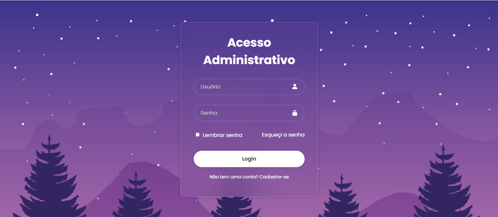

# Login Admin Page

Interface de login desenvolvida com HTML e CSS, simulando uma página de acesso administrativo com foco em layout, responsividade e experiência do usuário.

## Demonstração

> Se a imagem não aparecer, há uma cópia em: https://github.com/mariliamaary/login-admin-page/blob/main/login.png

## Funcionalidades
- Layout limpo e moderno
- Responsivo para diferentes tamanhos de tela
- Campos de formulário estilizados
- Foco na experiência do usuário (UX)

## Tecnologias
- HTML
- CSS

## Como usar
1. Clone o repositório:
   git clone https://github.com/mariliamaary/login-admin-page.git
2. Entre na pasta do projeto:
   cd login-admin-page
3. Abra index.html no seu navegador (duplo clique) ou use um servidor local (ex.: Live Server no VS Code).

## Estrutura do projeto (exemplo)
- index.html
- styles.css
- login.png
- assets/ (opcional: imagens, fontes, etc.)

## Personalização
- Edite index.html e styles.css para ajustar cores, fontes e comportamento.
- Substitua login.png por outra imagem, se desejar.

## Contribuição
Contribuições são bem-vindas! Abra uma issue para sugerir melhorias ou envie um pull request. Para mudanças pequenas, descreva as alterações no PR.

## Licença
Este repositório está licenciado sob a Licença MIT — veja o arquivo LICENSE para detalhes.

## Contato
Criado por mariliamaary. Para dúvidas ou sugestões, abra uma issue no repositório.